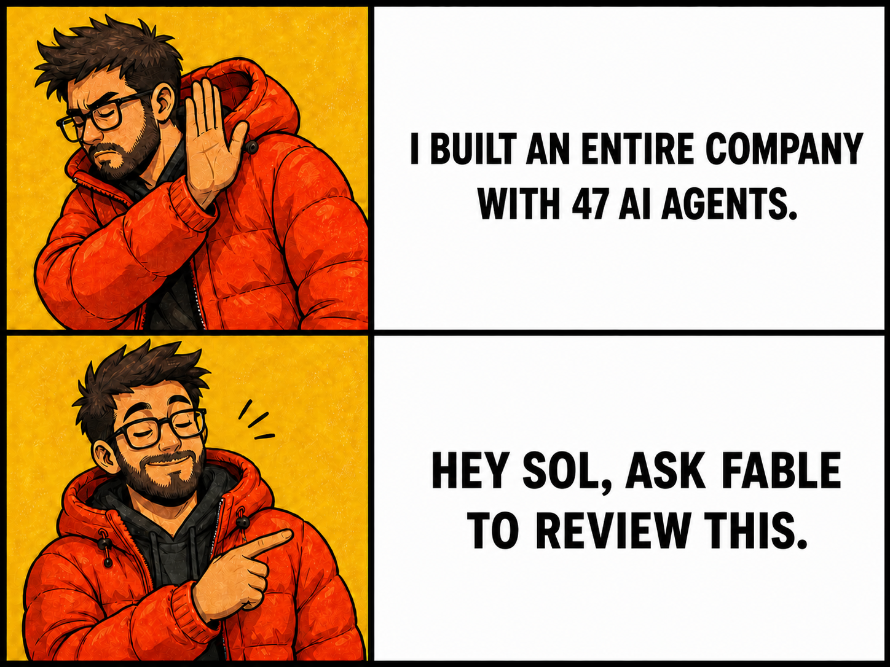

# dlgt

> Let agents delegate to the competition.

Codex wasn't built to delegate to Claude. Claude wasn't built to delegate to
Codex. `dlgt` was.

Once, everyone wanted an AI CEO, AI engineers, and an entire agent fleet. Most
of those products made a splash and disappeared. The useful part was simpler:
pick the frontier model you like, use the subagents already built into its
harness, and call the other side when it has something useful to add.

`dlgt` fills that one gap. It lets Codex use Claude and Claude use Codex.



## Quick Start

From Codex:

```bash
codex "Install https://github.com/combinatrix-ai/dlgt and make dlgt work"
```

From Claude:

```bash
claude -p "Install https://github.com/combinatrix-ai/dlgt and make dlgt work"
```

Then ask naturally:

```bash
codex "Create a great game. Ask Claude to review it."

claude -p "Think of 10 funny jokes. Ask Codex to review them."
```

No fleet to configure. No invented org chart. The harness you chose stays in
charge and uses `dlgt` when it needs a counterpart.

## What dlgt does

`dlgt` runs Codex and Claude as durable, addressable local Sessions. Each
Session owns one harness process, one PTY, one terminal screen, and at most one
active execution.

- Provider lifecycle hooks report readiness and completion.
- Sessions survive across commands and follow-up prompts.
- JSON output and JSONL RPC make delegation automatable.
- State, events, results, and bounded terminal history stay local.
- The leader sees the counterpart's result and decides what to use.

`dlgt` is not a planner, company simulator, workflow language, or multi-agent
framework. It is the bridge between two competing harnesses.

## Direct CLI use

Build the binary:

```bash
cargo build
```

Create a Claude Session and wait for its review:

```bash
dlgt new \
  --title "Claude review" \
  --harness claude \
  --model claude-fable-4-5 \
  --effort high \
  --cwd . \
  --wait \
  --timeout 15m \
  -- "Review this repository. Return findings and trade-offs only."
```

Create a Codex Session:

```bash
dlgt new \
  --title "Codex review" \
  --harness codex \
  --model gpt-5.6-luna \
  --effort xhigh \
  --cwd . \
  -- "Review the implementation and report correctness risks."
```

The command returns a Session ID such as `ses_7K3M9Q2X`:

```bash
dlgt wait ses_7K3M9Q2X --timeout 15m
dlgt send ses_7K3M9Q2X --wait --timeout 15m -- "Review the revision"
dlgt restart ses_7K3M9Q2X
dlgt show ses_7K3M9Q2X
dlgt scrollback ses_7K3M9Q2X --lines 100
dlgt attach ses_7K3M9Q2X
dlgt stop ses_7K3M9Q2X
```

The first client command starts the local daemon automatically.

## Configuration

Store reusable launch profiles in `~/.config/dlgt/config.toml`, or point
`DLGT_CONFIG` at another file:

```toml
[profiles.fable-review]
harness = "claude"
model = "claude-fable-4-5"
effort = "high"
clean_env = true
```

Set `DLGT_HOME` to relocate the SQLite database and Unix socket. Set
`DLGT_SOCKET` to override only the socket.

## Build and verify

```bash
cargo build
cargo fmt --all -- --check
cargo clippy --all-targets -- -D warnings
cargo test
cargo build && tests/smoke.sh
npm ci
npm run docs:build
```

## Documentation

- [Documentation site](https://combinatrix-ai.github.io/dlgt/)
- [CLI reference](docs/cli.md)
- [Local RPC](docs/rpc.md)
- [Design](docs/design.md)
- [Why not an agent fleet?](docs/orchestrator-landscape.md)

Run `dlgt skill` to print the agent-facing contract embedded from
[`assets/dlgt-skill.md`](assets/dlgt-skill.md). The binary has no runtime
dependency on an installed skill directory.

The PTY and attach architecture is derived from the private `umux` project.
