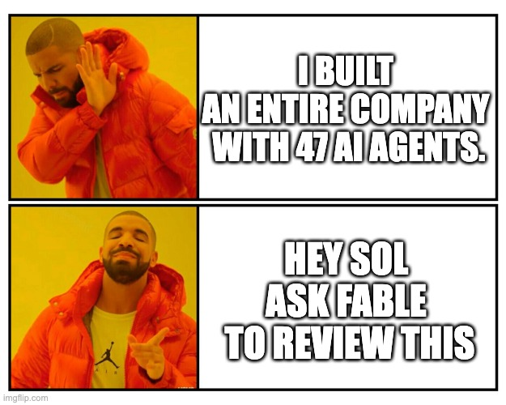

<picture>
  <source media="(prefers-color-scheme: dark)" srcset="assets/dlgt-lockup-dark.png">
  <source media="(prefers-color-scheme: light)" srcset="assets/dlgt-lockup-light.png">
  
</picture>

> Let agents delegate to the competition.

Codex wasn't built to delegate to Claude. Claude wasn't built to delegate to
Codex. `dlgt` was.

Once, everyone wanted an AI CEO, AI engineers, and an entire agent fleet. Most
of those products made a splash and disappeared. The useful part was simpler:
pick the frontier model you like, use the subagents already built into its
harness, and call the other side when it has something useful to add.

`dlgt` fills that one gap. It lets Codex use Claude and Claude use Codex.



## Quick Start

From Codex:

```bash
codex "Install and verify dlgt. Fetch https://combinatrix.ai/dlgt/installation.md with curl and follow its instructions."
```

From Claude:

```bash
claude "Install and verify dlgt. Fetch https://combinatrix.ai/dlgt/installation.md with curl and follow its instructions."
```

These are agent-executable installation instructions. The same source powers
the human-readable installation page and the raw Markdown guide fetched by the
agent. The agent should not report completion after installing only the binary:
the embedded skill must match the copies installed for Codex and Claude, and a
counterpart Session must complete a simple delegated task through dlgt.

Then ask either agent normally — neither prompt mentions dlgt. The installed
skill invokes it automatically, picks the counterpart model, and leaves effort
to the harness default unless you request one:

```bash
codex -m gpt-5.6-sol "Create a great game. Ask Fable to review it."

claude --model claude-fable-5 "Think of 10 funny jokes. Ask Sol at xhigh effort to review them."
```

No fleet to configure. No invented org chart. The harness you chose stays in
charge and uses `dlgt` when it needs a counterpart.

## Install

Install the latest published `dlgt` release on macOS or Linux. The installer
detects the platform, verifies the GitHub Release checksum, installs the
user-writable binary, and registers the embedded skill for every installed
Codex or Claude harness:

```bash
curl -fsSL https://raw.githubusercontent.com/combinatrix-ai/dlgt/main/install.sh \
  | sh -s -- --skill both
export PATH="$HOME/.local/bin:$PATH"
```

The README uses `--skill both` deliberately so following it always installs the
embedded skill at both `${CODEX_HOME:-$HOME/.codex}/skills/dlgt/SKILL.md` and
`$HOME/.claude/skills/dlgt/SKILL.md`; it does not depend on automatic harness
detection. Install a specific release with `--version v<version>`, or narrow
registration explicitly with `--skill codex` or `--skill claude`. The normal
installation path does not require Rust, Cargo, or a source checkout. See the
[full installation instructions](https://combinatrix.ai/dlgt/installation)
for supported targets and verification steps.

## What dlgt does

`dlgt` runs Codex and Claude as live, addressable local Sessions. Each
Session owns one harness process, one PTY, one terminal screen, and at most one
active execution.

- Provider lifecycle hooks report readiness and completion.
- Sessions survive across commands and follow-up prompts.
- JSON output and JSONL RPC make delegation automatable.
- State, events, results, and bounded terminal history stay local.
- The leader sees the counterpart's result and decides what to use.

`dlgt` is not a planner, company simulator, workflow language, or multi-agent
framework. It is the bridge between two competing harnesses.

## Why not the DIY routes

- **`tmux send-keys`** — the leader polls `capture-pane` and burns tokens on
  screen dumps, or you script UI heuristics that break on a spinner.
- **`claude -p` / `codex exec`** — every call is a cold start that throws away
  context, and headless runs sometimes aren't covered by your subscription.
- **`dlgt`** — completion is a lifecycle event, follow-ups keep their Session
  context, the managed PTY returns JSON instead of screen scrapes, and it runs
  on the plan you already pay for.

## Direct CLI use

After installing `dlgt`, create a Claude Session and read its review:

```bash
dlgt new \
  --title "Claude review" \
  --harness claude \
  --model claude-fable-5 \
  --effort high \
  --cwd . \
  --alias @review \
  --request-id review-1 \
  -- "Review this repository. Return findings and trade-offs only." \
  && dlgt fetch @review --until result --wait 15m
```

`new` waits up to five seconds for provider confirmation, then returns a
successful receipt with `submission: "confirmed" | "pending"`. `pending`
means local delivery succeeded; follow its `action` and do not resend with a
new request ID. `fetch` is the one observation command: it returns current
state, new results, lifecycle events, and the forward screen delta from a
cursor position. Chaining them prints two JSON documents, one per line; the
first receipt carries the Session ID and cursor. For anything longer than a
quick check, run the two commands separately so a lost read never costs you
the receipt.

Create a Codex Session:

```bash
dlgt new \
  --title "Codex review" \
  --harness codex \
  --model gpt-5.6-luna \
  --effort xhigh \
  --cwd . \
  --request-id codex-review-1 \
  -- "Review the implementation and report correctness risks."
```

The command returns one provider-qualified Session ID, such as
`codex:019f6307-341e-7e81-8a33-7ab61e804345`:

```bash
dlgt fetch codex:019f6307-341e-7e81-8a33-7ab61e804345 --until result --wait 15m
dlgt send codex:019f6307-341e-7e81-8a33-7ab61e804345 --request-id review-2 -- "Review the revision"
dlgt fetch codex:019f6307-341e-7e81-8a33-7ab61e804345 --cursor "$cursor"
dlgt restart codex:019f6307-341e-7e81-8a33-7ab61e804345
dlgt send codex:019f6307-341e-7e81-8a33-7ab61e804345 --resume --request-id review-3 -- "Continue the review"
dlgt show codex:019f6307-341e-7e81-8a33-7ab61e804345
dlgt scrollback codex:019f6307-341e-7e81-8a33-7ab61e804345 --lines 100
dlgt attach codex:019f6307-341e-7e81-8a33-7ab61e804345
dlgt stop codex:019f6307-341e-7e81-8a33-7ab61e804345
```

The first client command starts the local daemon automatically.

## Configuration

Store reusable launch profiles in `~/.config/dlgt/config.toml`, or point
`DLGT_CONFIG` at another file:

```toml
[profiles.fable-review]
harness = "claude"
model = "claude-fable-5"
effort = "high"
harness_options = ["permission-mode=auto"]
clean_env = true
```

dlgt launches both Harnesses auto-approved by default so delegation never
blocks on permission prompts. Opt out per Session with `--no-auto-approve` or
per Profile with `auto_approve = false`.

Set `DLGT_HOME` to relocate the versioned runtime sockets. Set `DLGT_SOCKET` to
override only the current version's socket. Session state is held in memory by
the daemon that owns the Harness processes. The returned Session ID is also
the provider conversation's durable resume selector: after that daemon exits,
pass the same `codex:<id>` or `claude:<id>` to `send --resume`. Plain `send`
scans live versioned sockets first, so a binary update routes that same ID back
to its owning daemon instead of creating a duplicate.

The daemon owns every provider process group. A sibling reaper runs in a
separate process group and ignores ordinary shutdown signals; when the daemon
is killed abruptly, loss of its control pipe terminates any provider groups
that were still registered.

## Build and verify

Contributor builds must name the `dlgt` binary explicitly:

```bash
cargo build --bin dlgt
cargo build --release --bin dlgt
cargo fmt --all -- --check
cargo clippy --all-targets -- -D warnings
cargo test
cargo build --bin dlgt && tests/smoke.sh
npm ci
npm run docs:build
```

## Documentation

- [Documentation site](https://combinatrix.ai/dlgt/)
- [Installation instructions](https://combinatrix.ai/dlgt/installation)
- [CLI reference](docs/cli.md)
- [Local RPC](docs/rpc.md)
- [Design](docs/design.md)
- [Why not an agent fleet?](docs/orchestrator-landscape.md)

Run `dlgt skill` to print the agent-facing contract embedded from
[`assets/dlgt-skill.md`](assets/dlgt-skill.md). The binary has no runtime
dependency on an installed skill directory.

For a source-built or otherwise preinstalled binary, register that exact
embedded skill without downloading another release:

```bash
sh install.sh --register-skills-from target/release/dlgt --skill both
```

The PTY and attach architecture is derived from the private `umux` project.
